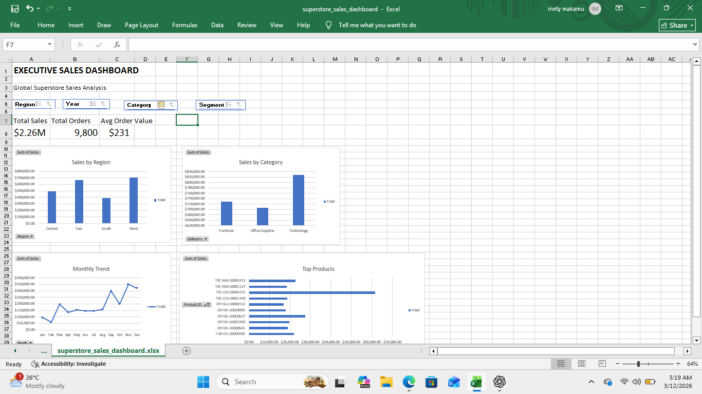

# Excel Sales Dashboard
## Dashboard Preview

This project analyzes the **Global Superstore dataset (~10,000 rows)** using Microsoft Excel.

The goal is to transform raw sales data into an **interactive executive dashboard** that helps identify key business insights.

## Tools Used

* Microsoft Excel
* Pivot Tables
* Data Cleaning
* Data Visualization
* Interactive Dashboard with Slicers

## Dashboard Features

* KPI metrics (Total Sales, Total Orders, Average Order Value)
* Sales by Region analysis
* Sales by Category comparison
* Monthly Sales Trend
* Top Performing Products
* Interactive filters using slicers

## Key Insights

* The **West region** generates the highest revenue.
* **Technology** is the best-selling category.
* Sales peak during **Q4**, indicating strong year-end demand.

## Files Included

* `superstore_sales_dashboard.xlsx` – Excel dashboard
* `dataset.csv` – Raw dataset used for analysis
* `dashboard.png` – Screenshot of the final dashboard

## Project Goal

This project demonstrates the **data analysis workflow in Excel**, including:

* Data cleaning
* Pivot table analysis
* Business insight generation
* Dashboard creation
